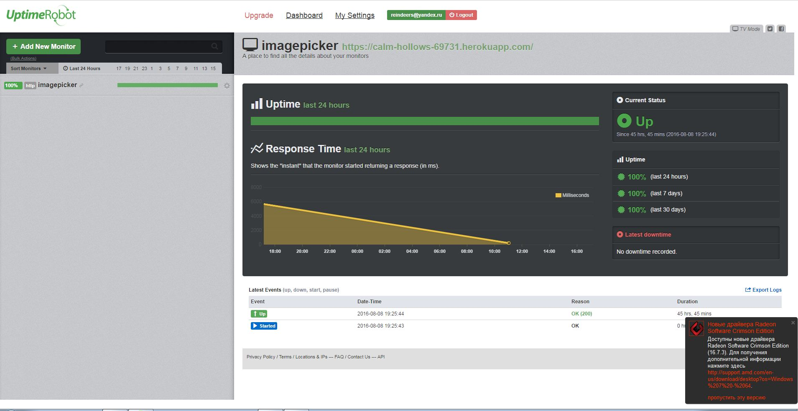

Приложение можно посмотреть по [ссылке](https://calm-hollows-69731.herokuapp.com)
В зависимости от разрешения монитора пользователя, выдает первую или вторую картинку. Баг: выдает только после перезагрузки страницы браузера.

Сделано все, кроме реализации тестов (об этом ниже). 

Так же, несовсем оказалось понятно про pull request. У меня сейчас получается так, что, когда я делаю pull request, гитхаб следит, чтобы он прошел одобрение линтера и трэвиса, если ничего не падает, у меня появляется возможность слить pull request в главную ветку, и тогда запустится сборка трэвиса. 

В логи пишет:
* скорость рендеринга страницы
* скорость разбора пришедшего на сервер запроса

По npm test запускается проверка eslint и mocha. Тестов для mocha нет, там закомменченный файл, почему-то у меня не получается их поднять, ругается на функцию getImage, если у вас будет возможность, было бы здорово узнать, почему.

#Uptime robot:
 

# Логи heroku

### Все логи делятся на три категории
* логи приложения
* системные логи
* логи api

## Логи приложения
логи, которые выводит само приложение, статус приложения (вызов node server.js, например).

## Системные логи
Информация о деплое (кем вызван, какая версия приложения, какой результат), состояние dyno, действия с процессами (например, вызов для приложения команды npm start)

## Логи api
у меня туда пишет только router. Статус запроса, метод, использующийся в запросе, ссылка, на которую посылается запрос, время обработки и т.д.

/
